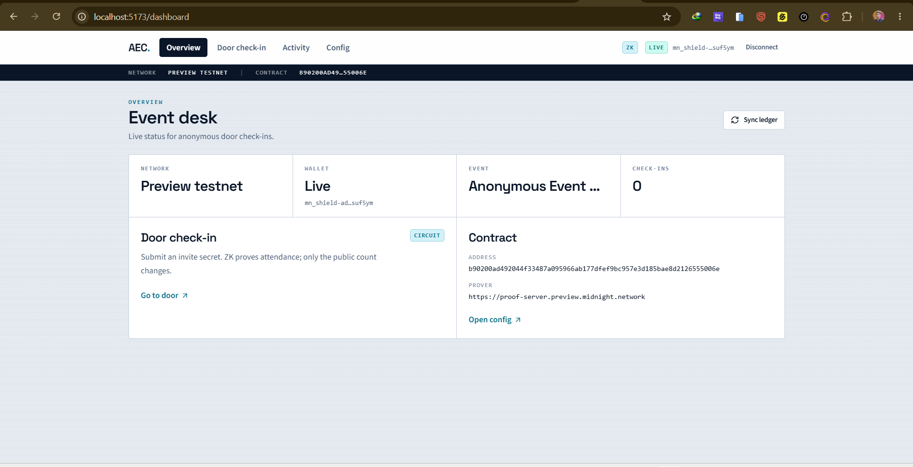
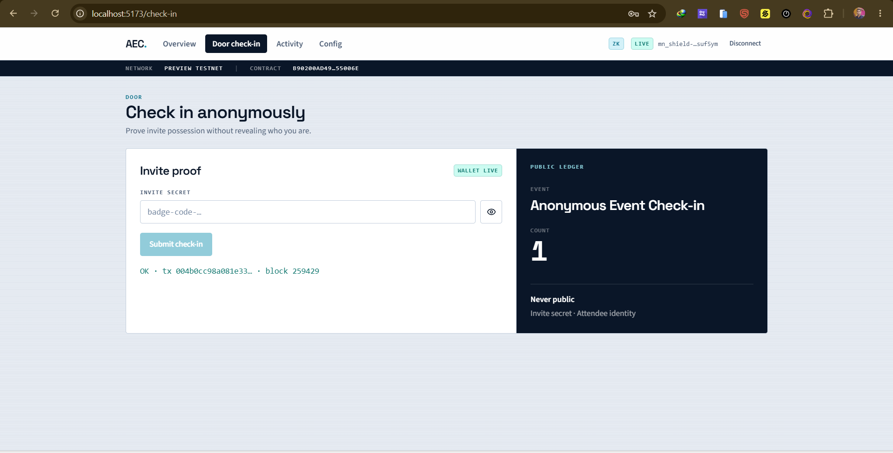
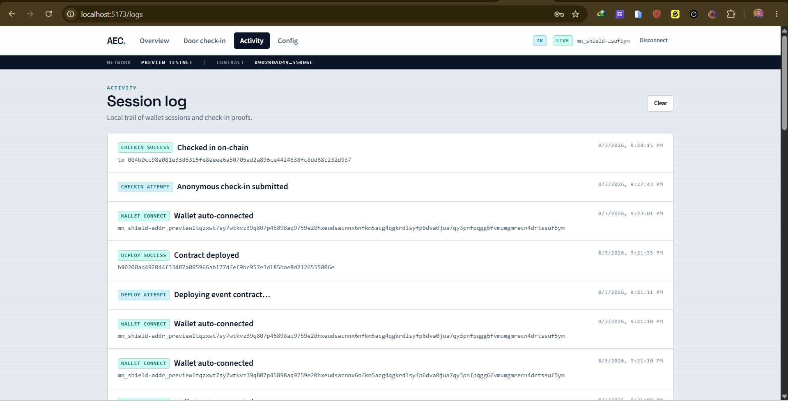
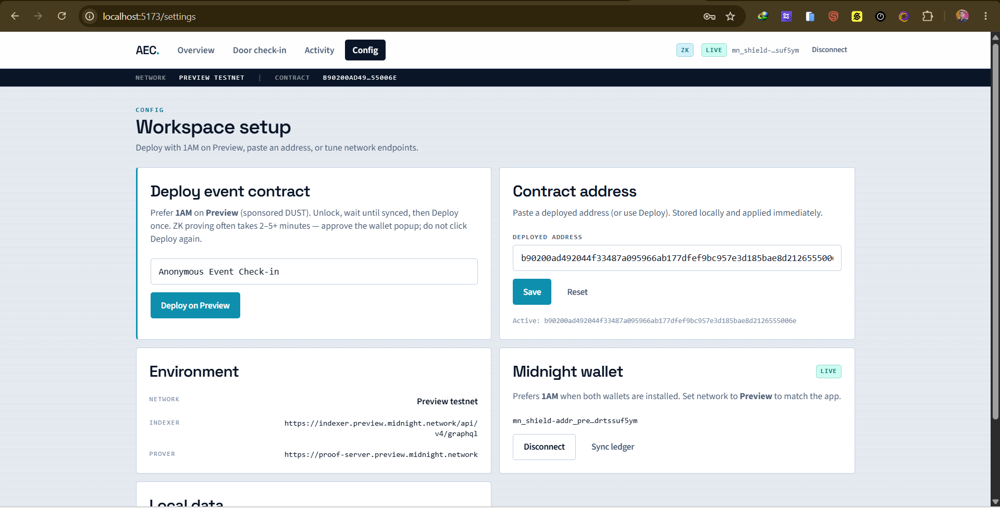

# Anonymous Event Check-in

A **Midnight** DApp where attendees prove they hold a valid invite/check-in secret **without revealing their identity or the secret**. The public ledger shows only the **event name** and a running **anonymous check-in count**.

[](https://github.com/saikattanti/anonymous-event-checkin/actions/workflows/ci.yml)
[](https://anonymous-event-checkin.vercel.app/)
[](https://youtu.be/gnPuRBhZtxc)
[](docs/PREVIEW_STATUS.md)
[](https://midnight.network)
[](PROPOSAL.md)
[](https://nodejs.org)
[](./package.json)

<p>
  <a href="https://anonymous-event-checkin.vercel.app/"></a>
  <a href="https://youtu.be/gnPuRBhZtxc"></a>
  <a href="https://preview.midnightexplorer.com/contracts/0xb90200ad492044f33487a095966ab177dfef9bc957e3d185bae8d2126555006e"></a>
  <a href="https://github.com/saikattanti/anonymous-event-checkin/actions/workflows/ci.yml"></a>
</p>

---

## Live Demo & Deployment

| Resource | Link / value |
| --- | --- |
| **Live Web Application** | [https://anonymous-event-checkin.vercel.app/](https://anonymous-event-checkin.vercel.app/) |
| **Local App UI** | [http://localhost:5173/](http://localhost:5173/) (`npm run dev:preview`) |
| **Preview Compact Contract** | `b90200ad492044f33487a095966ab177dfef9bc957e3d185bae8d2126555006e` |
| **Explorer** | [Preview contract](https://preview.midnightexplorer.com/contracts/0xb90200ad492044f33487a095966ab177dfef9bc957e3d185bae8d2126555006e) |
| **Demo Video** | [https://youtu.be/gnPuRBhZtxc](https://youtu.be/gnPuRBhZtxc) |
| **GitHub** | [saikattanti/anonymous-event-checkin](https://github.com/saikattanti/anonymous-event-checkin) |
| **CI** | [GitHub Actions](https://github.com/saikattanti/anonymous-event-checkin/actions/workflows/ci.yml) |
| **Product Proposal** | [PROPOSAL.md](PROPOSAL.md) |
| **Preview notes** | [docs/PREVIEW_STATUS.md](docs/PREVIEW_STATUS.md) |

**Target network:** Midnight **Preview** via **1AM** (Rise-In July migration — Preprod down / faucet offline). Deployed and verified on Preview indexer.

**Preview contract:** `b90200ad492044f33487a095966ab177dfef9bc957e3d185bae8d2126555006e`  
[Explorer](https://preview.midnightexplorer.com/contracts/0xb90200ad492044f33487a095966ab177dfef9bc957e3d185bae8d2126555006e) · [docs/PREVIEW_STATUS.md](docs/PREVIEW_STATUS.md)

---

## Screenshots & UI Showcase

### 1. Landing
Product entry and live public-ledger preview for anonymous event check-in.


### 2. Dashboard
Network badge, connected wallet, event name, and anonymous `checkInCount`.



### 3. Check-in
Submit an invite secret; the circuit proves knowledge without revealing identity.



### 4. Activity logs
Local browser activity trail for connect, deploy, and check-in actions.



### 5. Config / Settings
1AM Deploy on Preview, paste contract address, and inspect indexer / prover URIs.



---

## Product Proposal & Category

- **Category**: `Private Allowlist Access` (Rise-In Level 3)
- **Problem**: Event hosts need a verifiable headcount without collecting wallets or identities on-chain.
- **Solution**: Guests witness an invite secret inside a ZK circuit; the ledger only increments `checkInCount`.

Full write-up: [PROPOSAL.md](PROPOSAL.md)

---

## Privacy Model

| An observer CAN see | An observer CANNOT see |
| --- | --- |
| The `eventName` (set publicly at deploy) | The invite/attendee secret |
| The total `checkInCount` | Who checked in (no address on the ledger) |
| That a check-in transaction occurred | Any link between a check-in and a person |

Enforced in `contract/src/event-checkin.compact`: `disclose(name)` for the public event label only; `inviteSecret` is never disclosed or stored.

---

## Quick Start (Preview + 1AM)

```bash
npm install
npm run compile
npm run proof-server:preview   # local proof server on :6300
npm run dev:preview
```

1. Unlock **1AM** → network **Preview** → wait until **synced**
2. App prefers 1AM when Lace is also installed
3. **Settings → Deploy on Preview** once (2–5+ min ZK prove — approve the popup; do not double-click)
4. **Check-in** with any invite secret

Faucet: [https://faucet.preview.midnight.network/](https://faucet.preview.midnight.network/)

### Environment (`checkin-ui/.env.preview`)

| Variable | Purpose |
| --- | --- |
| `VITE_NETWORK_ID` / `VITE_MIDNIGHT_NETWORK` | `preview` |
| `VITE_CONTRACT_ADDRESS` | Published hex (empty until Deploy) |
| `VITE_INDEXER_URI` | Preview indexer |
| `VITE_INDEXER_WS_URI` | Preview indexer WS |
| `VITE_PROOF_SERVER_URL` | Local `:6300` for browser proving |

### Vercel production env

```
VITE_NETWORK_ID=preview
VITE_MIDNIGHT_NETWORK=preview
VITE_CONTRACT_ADDRESS=b90200ad492044f33487a095966ab177dfef9bc957e3d185bae8d2126555006e
VITE_INDEXER_URI=https://indexer.preview.midnight.network/api/v4/graphql
VITE_INDEXER_WS_URI=wss://indexer.preview.midnight.network/api/v4/graphql/ws
VITE_PROOF_SERVER_URL=https://anonymous-event-checkin.vercel.app/proof-server
```

Update `VITE_CONTRACT_ADDRESS` after a successful Preview deploy. `vercel.json` proxies `/proof-server/*` → Preview proof server for browser CORS.

---

## Circuits

| Circuit | Does | Discloses |
| --- | --- | --- |
| constructor `name` | Sets public event label | `eventName` |
| `checkIn(inviteSecret)` | Proves invite knowledge; increments count | Only that a valid proof ran |

---

## Submission Checklist

### Level 1
- [x] Compact contract + local deploy + CLI

### Level 2
- [x] Web UI with wallet connect (prefers **1AM**)
- [x] Browser **Deploy** + **Check-in**
- [x] Live **Preview** address published: `b90200ad492044f33487a095966ab177dfef9bc957e3d185bae8d2126555006e`

### Level 3
- [x] Tests, CI (GitHub Actions), privacy model, proposal
- [x] Demo video
- [x] Live demo URL

---

## Scripts

| Script | Description |
| --- | --- |
| `npm run compile` | Compact compile |
| `npm run proof-server:preview` | Proof server only (`:6300`) |
| `npm run dev:preview` | UI against Preview (`.env.preview`) |
| `npm run proof-server:preprod` / `dev:preprod` | Legacy Preprod path |
| `npm run setup` / `deploy` / `cli` | Local undeployed path |
| `npm run build` | Production UI |

## Project structure

```
anonymous-event-checkin/
├── contract/
├── checkin-cli/
├── checkin-ui/
├── proof-server-local.yml
├── vercel.json
└── README.md
```
