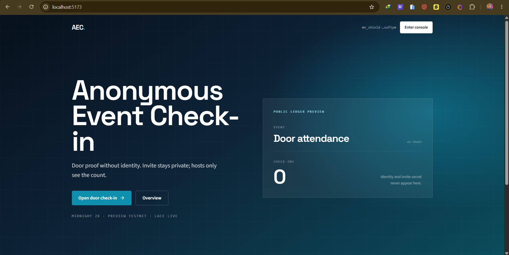
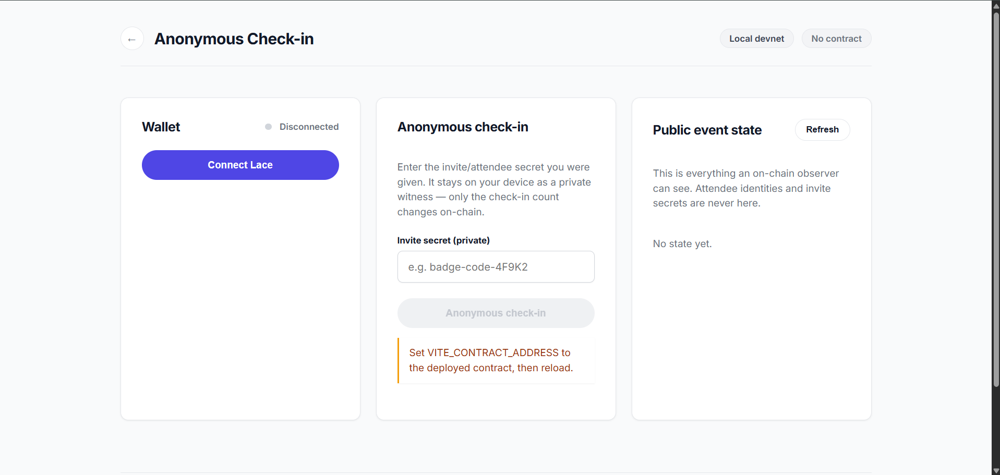

# Anonymous Event Check-in

A **Midnight** DApp where attendees prove they hold a valid invite/check-in secret **without revealing their identity or the secret**. The public ledger shows only the **event name** and a running **anonymous check-in count**.

[](https://anonymous-event-checkin.vercel.app/)
[](https://youtu.be/gnPuRBhZtxc)
[](https://midnight.network)
[](PROPOSAL.md)
[](https://nodejs.org)

---

## Live Demo & Deployment

| Resource | Link / value |
| --- | --- |
| **Live Web Application** | [https://anonymous-event-checkin.vercel.app/](https://anonymous-event-checkin.vercel.app/) |
| **Local App UI** | [http://localhost:5173/](http://localhost:5173/) (`npm run dev:preprod`) |
| **Preprod Compact Contract** | `Pending` |
| **Demo Video** | [https://youtu.be/gnPuRBhZtxc](https://youtu.be/gnPuRBhZtxc) |
| **GitHub** | [saikattanti/anonymous-event-checkin](https://github.com/saikattanti/anonymous-event-checkin) |
| **Product Proposal** | [PROPOSAL.md](PROPOSAL.md) |

**Target network:** Midnight **Preprod** via **1AM** (same path as CipherID / PulseBoard). The app is fully wired (wallet connect, browser Deploy, check-in, public ledger). **Preprod contract address: `Pending`** — on-chain deploy can be filled in when wallet sync / proving succeeds; do not block submission on that.

---

## Screenshots





---

## Product Proposal & Category

- **Category**: `Private Allowlist Access` (Rise-In Level 3)
- **Problem**: Event hosts need a verifiable headcount without collecting wallets or identities on-chain.
- **Solution**: Guests witness an invite secret inside a ZK circuit; the ledger only increments `checkInCount`.

Full write-up: [PROPOSAL.md](PROPOSAL.md)

---

## Privacy Model

| An observer CAN see | An observer CANNOT see |
| --- | --- |
| The `eventName` (set publicly at deploy) | The invite/attendee secret |
| The total `checkInCount` | Who checked in (no address on the ledger) |
| That a check-in transaction occurred | Any link between a check-in and a person |

Enforced in `contract/src/event-checkin.compact`: `disclose(name)` for the public event label only; `inviteSecret` is never disclosed or stored.

---

## Quick Start (Preprod + 1AM)

```bash
npm install
npm run compile
npm run proof-server:preprod   # local proof server on :6300
npm run dev:preprod
```

1. Unlock **1AM** → network **Preprod** → wait until **synced**
2. App prefers 1AM when Lace is also installed
3. **Settings → Deploy on Preprod** once (2–5+ min ZK prove — approve the popup; do not double-click)
4. **Check-in** with any invite secret

Faucet: [https://midnight-tmnight-preprod.nethermind.dev/](https://midnight-tmnight-preprod.nethermind.dev/)

### Environment (`checkin-ui/.env.preprod`)

| Variable | Purpose |
| --- | --- |
| `VITE_NETWORK_ID` / `VITE_MIDNIGHT_NETWORK` | `preprod` |
| `VITE_CONTRACT_ADDRESS` | Published hex (empty until Deploy) |
| `VITE_INDEXER_URI` | Preprod indexer |
| `VITE_INDEXER_WS_URI` | Preprod indexer WS |
| `VITE_PROOF_SERVER_URL` | Local `:6300` for browser proving |

### Vercel production env

```
VITE_NETWORK_ID=preprod
VITE_MIDNIGHT_NETWORK=preprod
VITE_CONTRACT_ADDRESS=Pending
VITE_INDEXER_URI=https://indexer.preprod.midnight.network/api/v4/graphql
VITE_INDEXER_WS_URI=wss://indexer.preprod.midnight.network/api/v4/graphql/ws
VITE_PROOF_SERVER_URL=https://anonymous-event-checkin.vercel.app/proof-server
```

Update `VITE_CONTRACT_ADDRESS` after a successful Preprod deploy. `vercel.json` proxies `/proof-server/*` for browser CORS.

---

## Circuits

| Circuit | Does | Discloses |
| --- | --- | --- |
| constructor `name` | Sets public event label | `eventName` |
| `checkIn(inviteSecret)` | Proves invite knowledge; increments count | Only that a valid proof ran |

---

## Submission Checklist

### Level 1
- [x] Compact contract + local deploy + CLI

### Level 2
- [x] Web UI with wallet connect (prefers **1AM**)
- [x] Browser **Deploy** + **Check-in**
- [x] Live Preprod address published **or** marked **`Pending`** (deploy path ready; address pending wallet sync)

### Level 3
- [x] Tests, CI, privacy model, proposal
- [x] Demo video
- [x] Live demo URL

---

## Scripts

| Script | Description |
| --- | --- |
| `npm run compile` | Compact compile |
| `npm run proof-server:preprod` | Proof server only (`:6300`) |
| `npm run dev:preprod` | UI against Preprod |
| `npm run setup` / `deploy` / `cli` | Local undeployed path |
| `npm run build` | Production UI |

## Project structure

```
anonymous-event-checkin/
├── contract/
├── checkin-cli/
├── checkin-ui/
├── proof-server-local.yml
├── vercel.json
└── README.md
```
